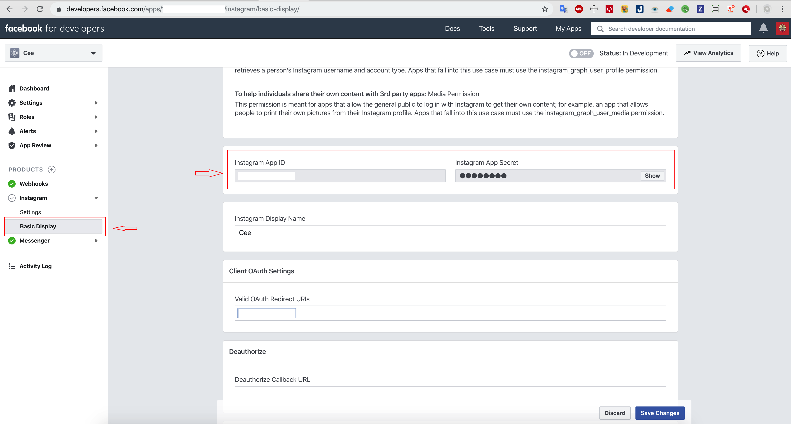

# React Native Instagram login
[](https://www.npmjs.com/package/react-native-instagram-login)
[](https://www.npmjs.com/package/react-native-instagram-login)

<p align="center">
  
</p>


### IMPORTANT NOTES:
`react-native-instagram-login` version 2 switches to the Instagram Graph API.

If you want to use old version 1, [please read docs](https://github.com/hungdev/react-native-instagram-login/tree/v1)

## Install

```js
npm install react-native-instagram-login react-native-webview --save
```

Then link the native iOS package: 

```js
npx pod-install
```

### Setup (React Native < 0.60.0):

### Automatic (recommended)

```
react-native link
```

with manual, [see more](https://github.com/react-native-community/react-native-webview/blob/master/docs/Getting-Started.md)

## How to get `appId`, `appSecret` of instagram?

> [Simple setup](https://developers.facebook.com/docs/instagram-basic-display-api/getting-started), you only need to complete step 3.

> Then go to Instagram> Basic Display> Instagram App ID field

<p align="center">
  
</p>

This is going to give you an access_token, which one can be used on the new Graph Api, go to https://developers.facebook.com/docs/instagram-basic-display-api/guides/getting-profiles-and-media for docs. 


## Usage:


```javascript
import React, { Component } from 'react';
import { View, Text, TouchableOpacity, StyleSheet } from 'react-native';
import InstagramLogin from 'react-native-instagram-login';
import CookieManager from '@react-native-community/cookies';

export default class App extends Component {
  constructor(props) {
    super(props);
    this.state = {
      token: '',
    };
  }

  setIgToken = (data) => {
    console.log('data', data)
    this.setState({ token: data.access_token })
  }

  onClear() {
    CookieManager.clearAll(true)
      .then((res) => {
        this.setState({ token: null })
      });
  }
  render() {
    return (
      <View style={{ flex: 1, justifyContent: 'center', alignItems: 'center' }}>
        <TouchableOpacity
          style={styles.btn}
          onPress={() => this.instagramLogin.show()}>
          <Text style={{ color: 'white', textAlign: 'center' }}>Login now</Text>
        </TouchableOpacity>
        <TouchableOpacity
          style={[styles.btn, { marginTop: 10, backgroundColor: 'green' }]}
          onPress={() => this.onClear()}>
          <Text style={{ color: 'white', textAlign: 'center' }}>Logout</Text>
        </TouchableOpacity>
        <Text style={{ margin: 10 }}>Token: {this.state.token}</Text>
        {this.state.failure && (
          <View>
            <Text style={{ margin: 10 }}>
              failure: {JSON.stringify(this.state.failure)}
            </Text>
          </View>
        )}
        <InstagramLogin
          ref={ref => (this.instagramLogin = ref)}
          appId='your-app-id'
          appSecret='your-app-secret'
          redirectUrl='your-redirect-Url'
          scopes={['user_profile', 'user_media']}
          onLoginSuccess={this.setIgToken}
          onLoginFailure={(data) => console.log(data)}
        />
      </View>
    );
  }
}


const styles = StyleSheet.create({
  btn: {
    borderRadius: 5,
    backgroundColor: 'orange',
    height: 30,
    width: 100,
    justifyContent: 'center',
    alignItems: 'center',
  }
});


```

## Props

| Property       | Type             | Description                                               |
| -------------- | ---------------- | --------------------------------------------------------- |
| appId          | PropTypes.string | Instagram App_id                                          |
| appSecret      | PropTypes.string | Instagram App_secret                                      |
| responseType   | PropTypes.string | 'code' or 'token', default 'code'                         |
| scopes         | PropTypes.array  | Login Permissions, default ['user_profile', 'user_media'] |
| redirectUrl    | PropTypes.string | Your redirectUrl                                          |
| onLoginSuccess | PropTypes.func   | Function will be call back on success                     |
| onLoginFailure | PropTypes.func   | Function will be call back on error                       |
| onClose        | PropTypes.func   | Function will be call back on close modal                 |
| modalVisible   | PropTypes.bool   | true or false                                             |
| renderClose    | PropTypes.func   | Render function for customize close button                |
| containerStyle | PropTypes.object | Customize container style                                 |
| wrapperStyle   | PropTypes.object | Customize wrapper style                                   |
| closeStyle     | PropTypes.object | Customize close style                                     |

## Server side explicit: [Discuss here](https://github.com/hungdev/react-native-instagram-login/issues/54)
If you dont want to expose `appSecret` on the client, you dont need to pass `appSecret` props in client. And `onLoginSuccess` will callback a `code`.

On your server (Backend) you have to call an api `https://api.instagram.com/oauth/access_token` with method `post` to exchange the code for a token, and params:

```
app_id: your-app-id
app_secret: your-app-secret
grant_type: 'authorization_code'
redirect_uri: your-redirect-url
code: code-get-from-onLoginSuccess-props
```

[For example](https://github.com/hungdev/react-native-instagram-login/blob/master/Instagram.js#L71-L88)

The response will look like this:

```
{
  "access_token": "IGQVJ...",
  "user_id": 17841405793187218
}
```


## Logout

~To logout use clear cookies by using https://github.com/react-native-community/cookies

```js
import CookieManager from '@react-native-community/cookies';

  logout() {
    CookieManager.clearAll(true)
      .then((res) => {
        console.log('CookieManager.clearAll =>', res);
        this.setState({ token: '' })
      });
  }
 ```
  ## Contributing
  Special thanks [@AlbertoIHP](https://github.com/AlbertoIHP) for v2.

  This project exists thanks to all the people who contribute. [[Contribute]](https://github.com/hungdev/react-native-instagram-login/graphs/contributors).

 ## Pull request
  Pull requests are welcome!
